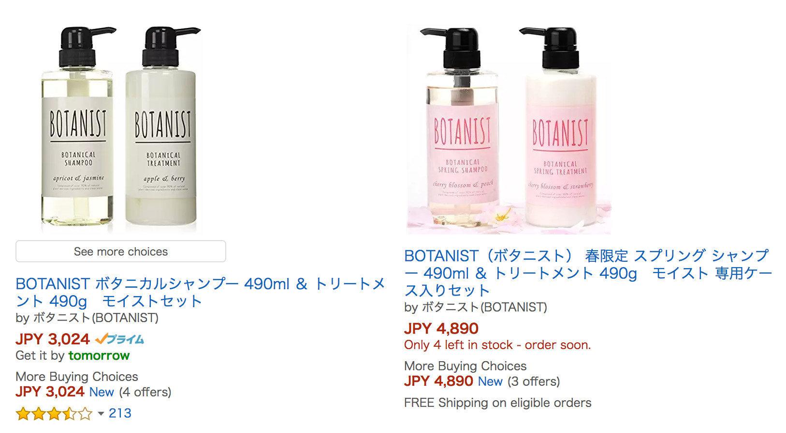
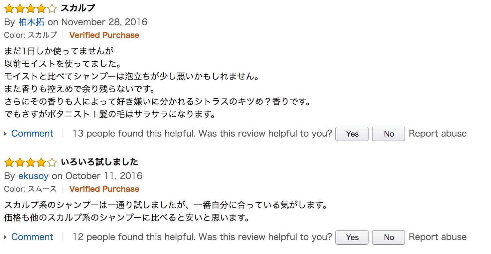

# Amazon Multi Language Reviews Scraper 
## *Last update March 2017. Works for Python2-3!*
Yet another Multi Language Scraper for Amazon targeting reviews.
<br/>
<div align="center">
  <br><br>
</div>

## How to get started?

### Installation
```
git clone git@github.com:philipperemy/amazon-reviews-scraper.git ars
cd ars
sudo pip install -r requirements.txt
```

### Search based on a keyword. Example: iPhone.
```
python amazon_comments_scraper.py -s iPhone # will search iPhone on Amazon.co.jp and fetch many comments!
```

### Search based on categories.
```
python amazon_products_scraper.py -o product_ids.txt # Get all the product ids first.
python amazon_comments_scraper.py -i product_ids.txt # Find all the comments for the products ids.
```

### Search based on categories (VPN).
Amazon bans after 5000 queries on average. Fortunately, you can bypass it with a VPN. Check the section VPN below and/or check this repository for more information [https://github.com/philipperemy/expressvpn-python](https://github.com/philipperemy/expressvpn-python).
```
python amazon_products_scraper.py -o product_ids.txt # Get all the product ids first.
python amazon_comments_scraper_vpn.py -i product_ids.txt # Find all the comments for the products ids.
```

### VPN

In my case, I subscribed to this VPN: [https://www.expressvpn.com/](https://www.expressvpn.com/).

I provide a python binding for this VPN here: [https://github.com/philipperemy/expressvpn-python](https://github.com/philipperemy/expressvpn-python).

Run those commands in Ubuntu 64 bits to configure the VPN with the Google News Scraper project:
```
git clone git@github.com:philipperemy/expressvpn-python.git evpn
cd evpn
sudo dpkg -i expressvpn_1.2.0_amd64.deb # will install the binaries provided by ExpressVPN
sudo pip install . # will install it as a package
```

Also make sure that:
- you can run `expressvpn` in your terminal.
- ExpressVPN is properly configured:
    - [https://www.expressvpn.com/setup](https://www.expressvpn.com/setup) 
    - [https://www.expressvpn.com/support/vpn-setup/app-for-linux/#download](https://www.expressvpn.com/support/vpn-setup/app-for-linux/#download)
- you get `expressvpn-python (x.y)` where `x.y` is the version, when you run `pip list | grep "expressvpn-python"`


## Some examples on Amazon Japan (Search based on a keyword)

Search = `BOTANIST ボタニカルシャンプー 490ml ＆ トリートメント 490g　モイストセット`

### Data processed by the scraper
```
[...]
2017-02-27 16:52:47,347 - INFO - ***********************************************
2017-02-27 16:52:47,347 - INFO - TITLE    = スカルプ
2017-02-27 16:52:47,347 - INFO - RATING   = 4
2017-02-27 16:52:47,347 - INFO - CONTENT  = まだ1日しか使ってませんが以前モイストを使ってました。モイストと比べてシャンプーは泡立ちが少し悪いかもしれません。また香りも控えめで余り残らないです。さらにその香りも人によって好き嫌いに分かれるシトラスのキツめ？香りです。でもさすがボタニスト！髪の毛はサラサラになります。
2017-02-27 16:52:47,347 - INFO - ***********************************************

2017-02-27 16:52:47,347 - INFO - ***********************************************
2017-02-27 16:52:47,347 - INFO - TITLE    = いろいろ試しました
2017-02-27 16:52:47,348 - INFO - RATING   = 4
2017-02-27 16:52:47,348 - INFO - CONTENT  = スカルプ系のシャンプーは一通り試しましたが、一番自分に合っている気がします。価格も他のスカルプ系のシャンプーに比べると安いと思います。
2017-02-27 16:52:47,348 - INFO - ***********************************************
```

### Content on amazon.co.jp
<div align="center">
  <br><br>
</div>
<div align="center">
  <br><br>
</div>
